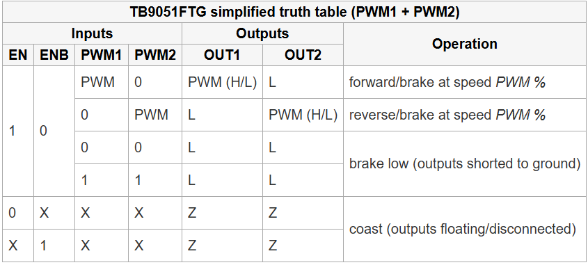

### UpperSteerByWire Demo Code
This code should contain test/demonstrations which verify that all hardware on the USBW board functions correctly.
#### Scope/Goals:
1) Demonstrate ability to control the steering wheel motor via onboard ESC
2) Demonstrate ability to read encoder data from the steering wheel motor
3) Demonstrate ability to transmit/receive on the CAN bus
#### Motor Control
The motor is a [Pololu 12V 100:1 gearbox brushed DC motor](https://www.pololu.com/product/4755). It's driven by a [TB9051FTG Driver Board](https://www.pololu.com/product/2997). This takes direct PWM and H-bridge inputs, similar to the BBW PWM board.

**Pin to pin connections:**
EN - CN3_9 - PB1 - GPIO Out
ENB - shorted to GND at all times   
PWM1 - CN3-12 - PA8 - TIM1CH1
PWM2 - CN3-1 - PA9 - TIM1CH2

Enable inputs are sent through a [bidirectional level shifter](https://www.sparkfun.com/sparkfun-logic-level-converter-bi-directional.html) (**U4 on schematics**)

_Spin the motor in both directions_
#### Motor Sensing
The motor has integrated quadrature encoding set at 64 counts per rotation. 

**Pin to pin connections:**
ENCA - CN4_7 - PA6 - GPIO_IN
ENCB - CN4_8 - PA5 - GPIO_IN

Encoder outputs are sent through a [bidirectional level shifter](https://www.sparkfun.com/sparkfun-logic-level-converter-bi-directional.html) (**U4 on schematics**)

_Correctly record counts and estimate motor position relative to starting position._
#### CAN Functionality

**Pin to pin connections:**
CAN Tx - CN3-5 - PA12 - CAN1Tx
CAN Rx - CN3-13 - PA13 - CAN1Rx

_Read and transmit some CAN packet._

#### HAL Enables
- CAN1
- TIM1 (ch1 and ch2)
- USART2
- GPIO on PA5, PA6, PB1